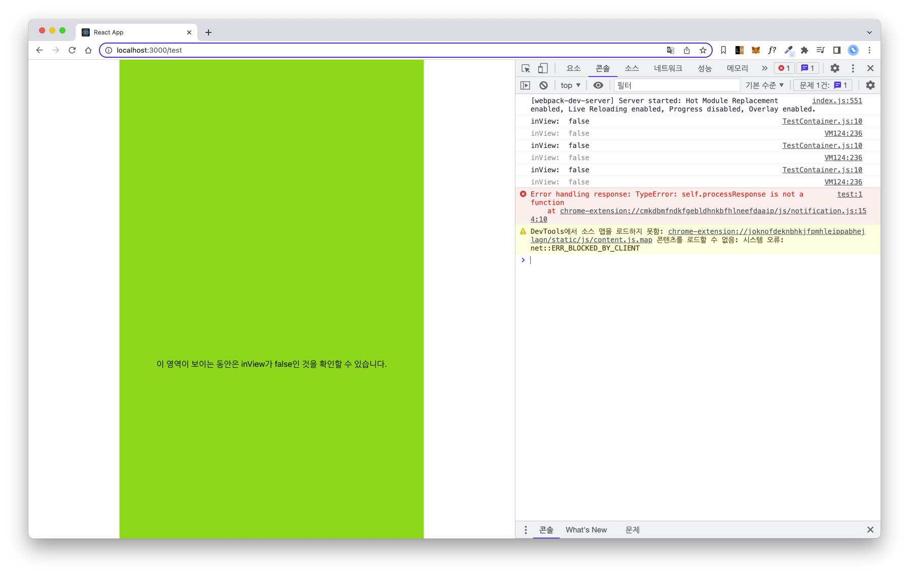
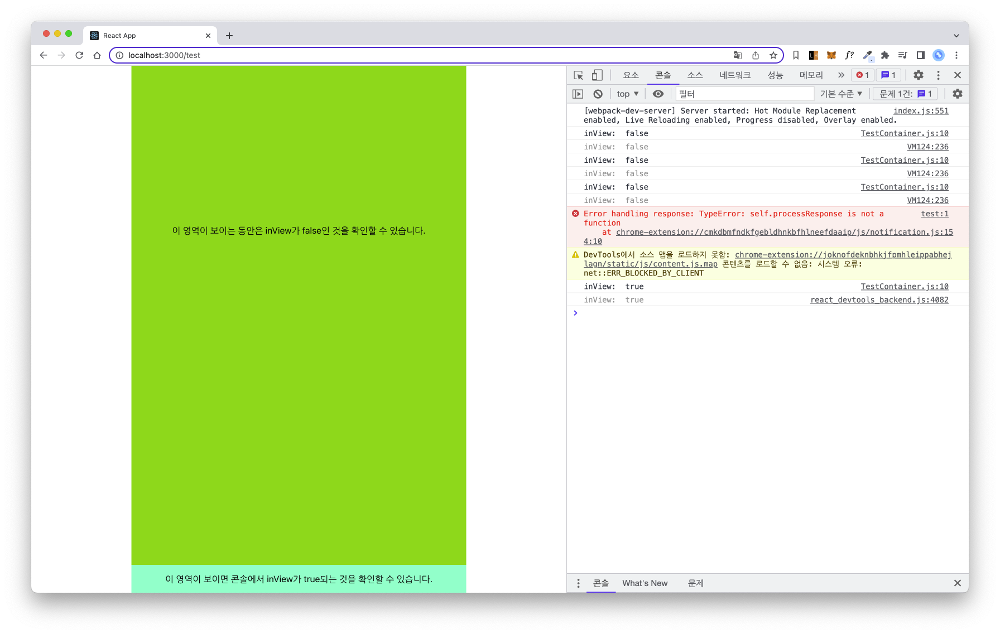
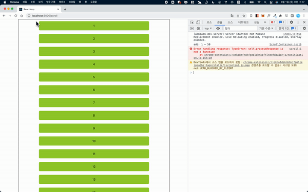

# infinite-scroll-react-test

> `react-intersection-observer` 라이브러리를 이용한 무한 스크롤 테스트 Repository 입니다.

## 학습 내용

- `useInView()` 함수에서 `ref, inView`를 가져옴
- 처음 가져온 `inView`의 값은 false이며, 화면에 `ref`가 보이면 `inView`가 true로 변경됨
- `inView`가 true가 될 때마다 비동기 요청 (fetch)

## 테스트

`http://localhost:3000/test`:

- 개발자 도구에서 Element가 보일 때 true, 안보일 때 false가 되는 것을 확인

`http://localhost:3000/scroll`:

- `inView`가 true일 때 단 한번만 데이터를 추가하도록 구성
- 처음 렌더링시 1부터 50 블럭만 나오지만, 그 이후에는 51부터 100 블럭이 새로 추가되는 것을 확인

## 사용한 라이브러리

- react-router-dom
- sass
- [react-intersection-observer](https://www.npmjs.com/package/react-intersection-observer)

## 참고

- https://slog.website/post/8
